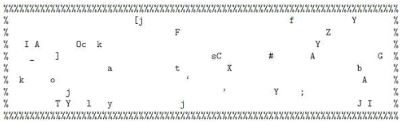
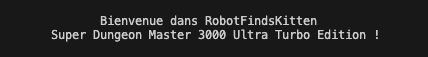
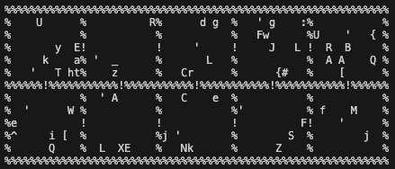

# RobotFindsKitten
Defintion - From Wikipedia, the free encyclopedia, robotfindskitten (rfk) is a "Zen simulation", originally written by Leonard Richardson for DOS.

## Context
You embody a Robot (#) searching for Kitten (affectionately nicknamed Kitten) and examining each object on the grid until it finds Kitten (no time constraints, no life bar, no score, ...). The main objective is to have a good time contemplating the various non-kitten objects (Non-Kitten-Items) found in the level.

## Original Game
The game is represented as an ASCII grid:



Each time the robot walks on an item that is not the kitten, a description of that item is displayed. Some examples:
- This is a tasty-looking banana creme pie.
- It’s a business plan for a new startup, kitten.net.
- An automated robot-liker. It smiles at you.
- A book with “Don’t Panic” in large friendly letters across the cover.

Each item on the grid has a fixed description randomly selected at the beginning of the game from a bank of Non-Kitten-Items descriptors. The game ends when the Robot finds Kitten.

A web version of the original game is available here: http://robotfindskitten.org/play/robotfindskitten/

## Modified Game
I recreated this game by addng a few elements to spice it up:
- Instead of being one large open room, the game grid is divided into locked rooms.
- The robot can collect keys to open doors and move to the next room.
- Each room contains some Non-Kitten-Items and a key (represented by an apostrophe).
- One of the Non-Kitten-Items on the grid is a Teleporter, which allows the robot to move to a random position on the grid upon request.

## How To Play
```shell
git clone https://github.com/dthierno/RobotFindsKitten.git RobotFindsKitten
cd RobotFindsKitten
javac RobotFindsKitten.java
java RobotFindsKitten
```

After running these commands, you should be greeted by a welcome message:



The game grid will then be generated semi-randomly:
- Walls (%) are placed around each room with a door in the middle (!) to move from one room to another.
- A key is placed on a randomly chosen cell in each room.
- Non-Kitten-Items and the Kitten are randomly placed on the grid (the representation of Non-Kitten-Items and the Kitten is randomly selected from a set of ASCII characters).
- In addition to the Non-Kitten-Items, a Teleporter is hidden somewhere on the game grid.

Once generated, the grid should look something like this:



The grid is displayed, and then a prompt asks the user to enter their move:

```shell
R.O.B  [0]>
``` 

The prompt represents the robot's status: {Robot's Name} [{number of keys in its possession}]

- The robot can explore the map by entering the commands w, a, s, or d, respectively, to move in the Up, Left, Down, or Right directions.
- When the robot picks up a key, it can use it to unlock one of the doors (which will remain unlocked for the rest of the game).
- If the robot has the teleporter, it can enter the command t to teleport to a random empty square on the grid. Additionally, a T is added to the end of the prompt to indicate that it can teleport:

```shell
R.O.B  [0]T>
``` 

- The grid is displayed, and the next move is requested until the robot finds Kitten.
When the robot finds Kitten, the following message is displayed: `
You found kitten! Way to go, robot.
Caramel <3 R.O.B.
` 
Where Caramel <3 R.O.B. corresponds to {Kitten's Name} <3 {Robot's Name} And the program ends.


## Change from the original game
Note that unlike the original game, it is possible to walk on the NonKittenItems. This will simplify the implementation and avoid cases where the robot could get stuck in its starting position.

## License

This project is licensed under the MIT License - see the LICENSE.md file for details.
